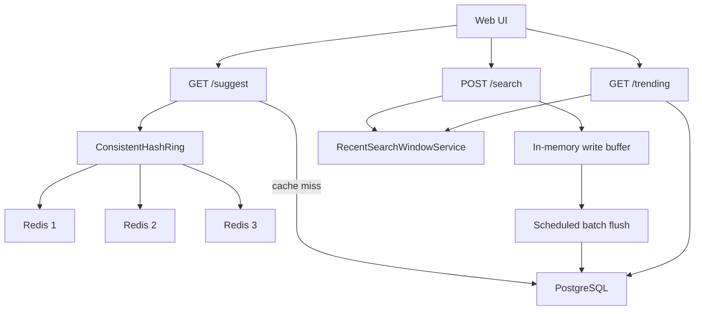

# Search Typeahead System

Distributed search typeahead system built with Java 21, Spring Boot 3.5, PostgreSQL, and a three-node Redis cache ring.

The project now includes:

- Dataset-backed typeahead suggestions
- Debounced web UI with keyboard navigation
- Dummy search submission API
- Three logical Redis cache nodes with consistent hashing
- Cache debug endpoint
- Recency-aware trending and suggestion ranking
- In-memory aggregation with scheduled batch writes
- Metrics endpoint for hit rate, latency, and write reduction

## Run Locally

### 1. Start PostgreSQL and Redis

```powershell
docker compose up -d
```

This starts:

- PostgreSQL on `localhost:5433`
- Redis node `redis-1` on `localhost:6379`
- Redis node `redis-2` on `localhost:6380`
- Redis node `redis-3` on `localhost:6381`

### 2. Start the backend

```powershell
cd backend
.\mvnw.cmd spring-boot:run
```

### 3. Open the app

- UI: [http://localhost:8080](http://localhost:8080)
- Health: [http://localhost:8080/health](http://localhost:8080/health)

The UI source now lives in [frontend/index.html](C:/Users/archi/Github%20Projects/search-typeahead-system/frontend/index.html), but it is still served by Spring Boot at `http://localhost:8080`, so no separate frontend server is needed.

## Dataset

- File: `dataset/count_1w.txt`
- Current size: about `333,333` rows
- Format: `<query><space><count>`
- Loader behavior:
  - loads the dataset only when the table is empty
  - normalizes terms to lowercase
  - supports multi-word queries by splitting on the last space

## Architecture



Detailed notes live in:

- [docs/ARCHITECTURE.md](docs/ARCHITECTURE.md)
- [docs/API.md](docs/API.md)
- [docs/PERFORMANCE_REPORT.md](docs/PERFORMANCE_REPORT.md)

## APIs

### `GET /suggest?q=<prefix>`

Returns up to 10 recency-aware suggestions for a prefix.

### `POST /search`

Records a submitted search term without writing synchronously to PostgreSQL.

Request body:

```json
{
  "term": "service mesh"
}
```

### `GET /trending`

Returns top trending terms using historical popularity plus a recent-search boost.

### `GET /cache/debug?prefix=<prefix>`

Shows which Redis node owns the prefix and whether the key is currently cached.

### `GET /metrics/summary`

Returns cache hit rate, DB reads, batch writes, flush volume, and latency samples.

## Assignment Coverage

- Basic implementation: complete
- Trending searches: complete
- Batch writes: complete
- Distributed cache with consistent hashing: complete
- UI requirements: complete
- Submission documentation: included

## Verification

Verified locally on June 22, 2026 with:

- `docker compose up -d`
- `backend\mvnw.cmd test`
- live endpoint checks for `/health`, `/suggest`, `/search`, `/cache/debug`, `/trending`, and `/metrics/summary`
